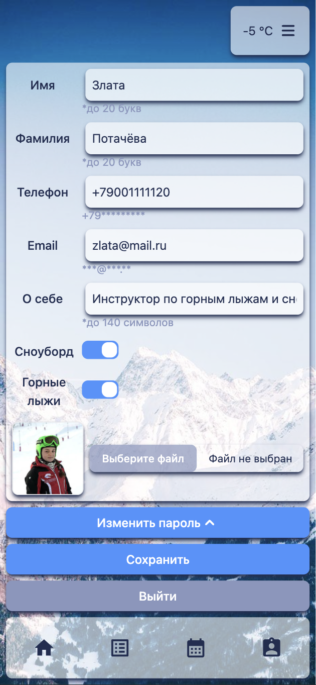

# snow-ski
Мобильное web-приложение горнолыжного курорта для бронирования номеров и выбору инструктора

<h1>SKI RESORT<h1>

  

    
    
    
    
    
    
    
    
    
    
  

<h3>Описание</h3>

  Мобильное web-приложение дает возможность пользователю оплатить ski-pass, отслеживать свободные номера и коттеджи по выбранным датам, бронировать их, а также подбирать свободного инструктора по горным лыжам или сноуборду в выбранное время и бронировать их. Помимо обычного пользователя реализовано 2 дополнительных роли: инструктор и администратор. С помощью приложения инструктор может отслеживать рабочий график и менять его. Для администратора доступна возможность отслеживать график занятости коттеджей и номеров, просматривать информацию о пользователях, бронировать номера и коттеджи для других пользователей, редактировать информацию о них.
  Для запуска проекта необходим PostgreSQL. Действия:
  <ul>
    <li>открыть 2 терминала в директориях server и client;</li>
    <li>установить необходимые зависимости с помощью команды npm i в каждом терминале;</li>
    <li>создать базу данных и запустить сервер, запустить клиент с помощью команды npm run start в каждом терминале.</li>
    </ul>
  

<h3>Стек проекта</h3>
<h5>Backend</h5>

<h5>Frontend</h5>

<h5>Others</h5>

