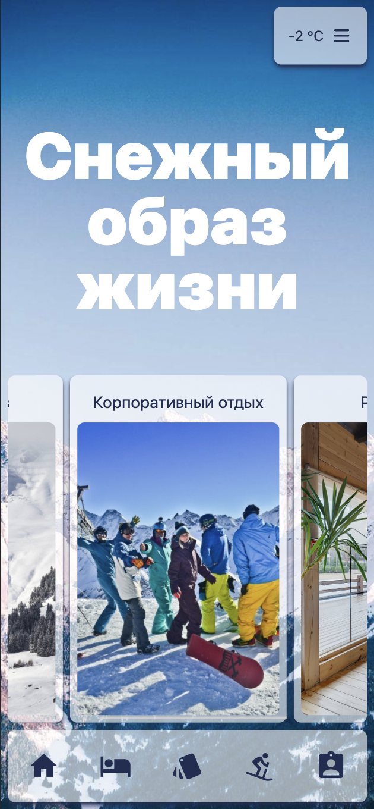

# snow-ski

<h3 align="left">Мобильное web-приложение горнолыжного курорта для бронирования номеров и выбору инструктора</h3>

<h3>Описание</h3>

Мобильное web-приложение дает возможность:
<ul>
<li>

оплатить ski-pass (пользователь);

</li>
<li>

отслеживать свободные номера и коттеджи по выбранным датам, бронировать их (пользователь);

</li>
<li>

подбирать свободного инструктора по горным лыжам или сноуборду в выбранное время, бронировать их (пользователь);

</li>
<li>

отслеживать рабочий график и менять его (инструктор);

</li>
<li>

отслеживать график занятости коттеджей и номеров, просматривать информацию о пользователях, бронировать номера и коттеджи для других пользователей, редактировать информацию о них (администратор);

</li>
</ul>
<h3>Стек проекта</h3>
<h5>Backend</h5>

<h5>Frontend</h5>

<h5>Others</h5>

